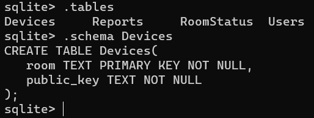
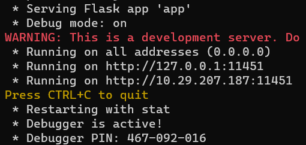
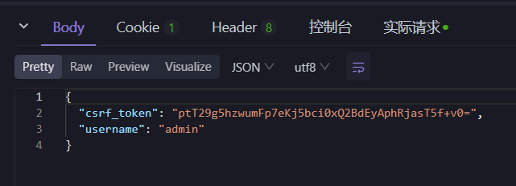

```
backend/
|-- app/
|      |-- views/           # 视图
|          |-- __init__.py  # 测试文件
|          |-- admin.py     # 设备管理相关的视图函数
|          |-- auth.py      # 登录和注销的视图函数
|          |-- client.py    # 处理有关客户端
|          |-- control.py   # 处理客户端控制操作
|          |-- query.py     # 数据查询相关的视图函数
|          |-- room.py      # 房间相关的视图函数
|      |-- config.py        # 配置文件
|      |-- models.py        # 数据库模型
|      |-- run.py           # 构建实例
|      |-- scheduler.py     # 调度逻辑
|      |-- utils.py         # 辅助函数和工具函数
|-- data/
|      |-- buptse.db        # Sqlite 数据库
|      |-- Bupt.db          # Sqlite 数据库备份
|      |-- buptse.sql       # SQL 文件
|-- start_client.py         # 运行文件
```
## 后端部分交互使用说明文档

> Written by @Conqueror712 🤗

要测试route是否可用，以便进行下一步的开发与使用，请确保拥有以下测试环境：

> 注：并非一定要用这些环境才能进行测试，仅供参考

- OS: Windows 10/11
- API测试工具: Apifox/Postman
- Python环境: requirements.txt中所需的所有第三方库
- Project src: git clone git@github.com:Cloud0310/BUPT-2023-SE-Homework.git
- DBMS: SQLite

### 1. 打开SQLite并连接数据库

请确保你正确安装了SQLite并添加了相应的环境变量，随后打开一个PowerShell输入命令以打开SQLite:

```
sqlite3
```

可以使用以下方法创建一个数据库（方法不唯一，这种方法如果`xxx.db`存在则直接会打开，不存在就创建它）:

```
sqlite>.open buptse.db
```      

> 注意，这条命令前面的`sqlite>`不需要我们输入，另外，这会在当前目录下创建，请确保你的路径正确，在本项目中，默认在相对路径`/backend/data/`下

你可以使用以下指令来查看是否成功创建，当然也可以在文件夹中直接查看:

```
>sqlite>.databases
```

另外，如果你发现你的terminal中的输出并不直观，可以使用以下命令来开启格式化输出:

```
sqlite>.header on
sqlite>.mode column
sqlite>.timer on
```

可以使用以下命令来查看你的SQLite配置:

```
sqlite>.show
```

如果你倦了，那么可以使用以下命令来退出SQLite，请尽量不要暴力退出:

```
sqlite>.quit
```

当你想导出完整的`.sql`文件的时候，可以使用如下命令:

```
sqlite3 xxx.db .dump > xxx.sql
```

当然，也可以由`.sql`恢复成`.db`:

```
sqlite3 xxx.db < xxx.sql
```

> 注：这里导出的`.sql`文件的编码格式为ASCII

```
sqlite>.tables
```

### 2. 创建表命令（如果是 clone 的 Repo 则可以略过此步）

你可以使用以下命令得到表的完整信息:

```
sqlite>.schema table_name
```



> 以下是创建表的命令，如果你是 clone 的则不需要创建。

```
sqlite> CREATE TABLE Users(
   username TEXT PRIMARY KEY NOT NULL,
   role TEXT NOT NULL
);

sqlite> CREATE TABLE Devices(
   room TEXT PRIMARY KEY NOT NULL,
   public_key TEXT NOT NULL
);

sqlite> CREATE TABLE RoomStatus(
   room TEXT PRIMARY KEY NOT NULL,
   temperature INT NOT NULL,
   wind_speed INT NOT NULL,
   mode TEXT NOT NULL,
   sweep BOOLEAN NOT NULL,
   is_on BOOLEAN NOT NULL,
   last_update TEXT NOT NULL
);

sqlite> CREATE TABLE Reports(
   room TEXT NOT NULL,
   start_time TEXT NOT NULL,
   end_time TEXT NOT NULL,
   temperature INT NOT NULL,
   wind_speed INT NOT NULL,
   mode TEXT NOT NULL,
   sweep BOOLEAN NOT NULL,
   duration INT NOT NULL,
   cost INT NOT NULL,
   PRIMARY KEY (room, start_time),
   FOREIGN KEY (room) REFERENCES RoomStatus(room)
);
```

### 3. 启动 Web Server

切换回 `backend` 目录，保证 Sqlite 运行的情况下，输入 `python cli.py run` 运行

你可以看到 Server 被启动，可以点击访问



比如你可以访问 `http://127.0.0.1:11451/hello`

或者你使用登录功能，访问 `http://127.0.0.1:11451/api/login`，参数在 Body 里写这样的 json:

```
{
  "username": "admin",
  "password": "admin"
}
```



退出登录的话，就 `http://127.0.0.1:11451/api/logout`